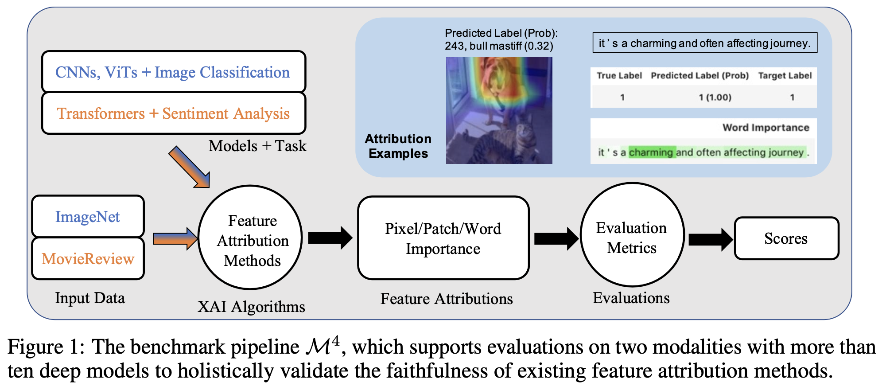

# Reproducible Source Codes for the $M^4$ XAI Benchmark

Note that this code is for the reproducible purpose. 
A wrapper for these modulars is on the plan.

This code is implemented using PaddlePaddle and InterpretDL.
A demo using HuggingFace models and InterpretDL can be found [here](medical_image_example.ipynb).
A demo using Pytorch models and InterpretDL can be found [here](https://colab.research.google.com/drive/1ZgI1ctCc2ryPk0bdPgkEwQCJ1tHZCq14?usp=sharin).

Paper: 

> Xuhong Li, Mengnan Du, Jiamin Chen, Yekun Chai, Himabindu Lakkaraju, Haoyi Xiong. “M4: A Unified XAI Benchmark for Faithfulness Evaluation of Feature Attribution Methods across Metrics, Modalities and Models.” Neurips 2023, Dataset and Benchmark Track. https://openreview.net/forum?id=6zcfrSz98y.

Pipeline:

## A first glance of the source codes:

- `benchmark_data`: stores the data that are used by the benchmark.

- `benchmark-cv`: benchmark for the image modality.

- `benchmark-nlp`: benchmark for the text modality.

- `training`: the process for training on the synthetic dataset of yellow patches.

- `training_nlp`: Finetuning the NLP models on the MovieReview dataset.

## Steps

To perform the benchmark, it is required to follow the steps as below:

1. Prepare the dataset. ImageNet or MovieReview. Note that when using these datasets, you agree to the terms from ImageNet or MovieReview respectively.

(Step 2 is optional. One can download or prepare a trained model.)

2. Train models (only required for NLP models). See `training_nlp/train.sh`.

(Step 3 is only required for the SynScore calculation.) 

3. Train models on the synthetic dataset. See `training/train.sh`.

4. Compute explanations. See `benchmark-cv/run_expl.sh` for image modality. See `benchmark-nlp/run_expl.sh` for text modality. We compute all the explanation results at once and save them locally. This can avoid repeating the computations.

5. Eval MoRF,ABPC. See `benchmark-cv/run_eval.sh` for image modality. See `benchmark-nlp/run_eval*.sh` for text modality.

6. Eval Others. See `benchmark-cv/run_eval-pgs.sh` for image modality. See `benchmark-nlp/run_eval2.sh` for text modality.

## Feel free to open issues.
